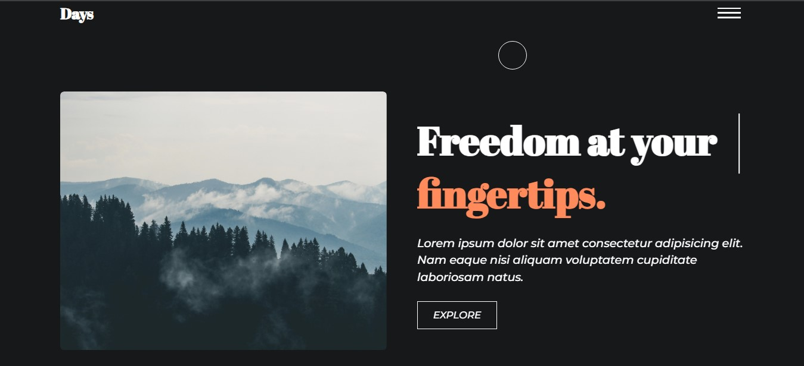

# travel-website



## Introduction

Welcome to the Travel Website! This README will provide you with an overview of the project.

You can view the live website at:

```bash
https://hallowdread.github.io/travel-website/
```

## Features

- **Stunning Visuals**: High-quality images and graphics to captivate users' attention.
- **Smooth Animations**: JavaScript animations powered by GSAP for fluid and dynamic transitions between different elements on the website.
- **Scroll Animations**: Utilization of ScrollMagic library to create scroll-based animations, enhancing user engagement and interactivity.
- **Responsive Design**: Ensuring optimal viewing experience across various devices and screen sizes.
- **Interactive Elements**: Incorporation of interactive elements such as buttons, sliders, and hover effects to enhance user interaction.
- **Smooth Page Transitions**: Seamless transitioning between web pages achieved with Barba.js for an uninterrupted browsing experience.

## Technologies Used

- **HTML5**: Markup language for structuring the website's content.
- **CSS3**: Styling language for designing the layout and visual appearance.
- **JavaScript**: Programming language for implementing dynamic functionality and animations.
- **GSAP (GreenSock Animation Platform)**: JavaScript library for creating high-performance animations.
- **ScrollMagic**: JavaScript library for scroll animations.
- **Barba.js**: JavaScript library for smooth transitioning between web pages.

1. **Clone Repository**:

   ```bash
   git clone [https://github.com/Hallowdread/travel-website.git]
   ```

2. **Navigate to Project Directory**:

   ```bash
   cd travel-website
   ```

3. **Open in Browser**:

   - Locate the `index.html` file in the project directory.
   - Right-click on `index.html` and open it with your preferred web browser.

4. **Explore**:
   - Once the website is open in your browser, navigate through different pages and experience the animations and interactivity.
